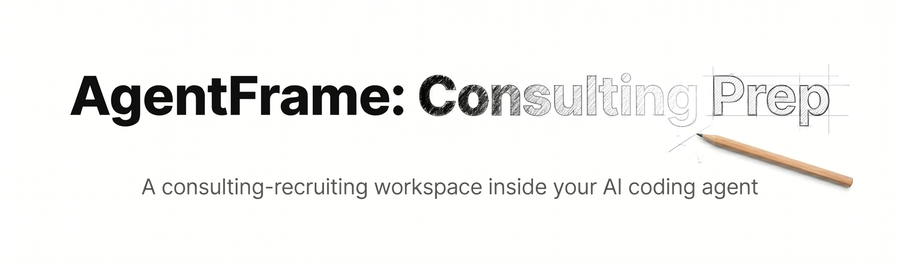

# AgentFrame: Consulting Prep

<p align="center">
  
</p>

> **A starter kit for consulting recruiting that lives inside your AI coding agent.** Case practice + tailored
> applications, as markdown + skills you can read and rewrite. It's got the bones — the point is that *you*
> take it from here.

> Works with anything that reads `AGENTS.md` — Claude Code, Codex, Cursor, VS Code.

**Jump to:** [What this is](#what-this-is-and-isnt) · [Quick start](#quick-start) · [Why](#why-this-exists) · [At a glance](#at-a-glance) · [Make it yours](#make-it-yours) · [Connectors](#connectors)

---

## What this is (and isn't)

Read this first, because it sets the right expectations. This is a starting point rather than a finished
product: there's a working skeleton here — an agent that runs you through a case, reviews it honestly, tailors a
resume and cover letter, and researches a firm — but it's deliberately unfinished, and it's meant to be forked,
broken, extended, and made yours.

It isn't a polished tool like [AgentFrame: Marketing](https://github.com/situhacks/agentframe-marketing), its
more mature older sibling, so don't expect everything to be airtight or pretty out of the box. What you should
expect is a solid draft that does real work and leaves obvious room for you to improve it.

That gap is the point. The kit isn't trying to hand you a perfect machine, it's trying to give you something
real to take apart, and as you tweak the skills, add your own cases, change how the agent talks to you, and fix
the things you don't like, you end up learning how these AI systems actually work under the hood. That
understanding — how to build and shape an agent, not just use one — is the thing worth walking away with, and
the resume help and case reps are the bonus that comes with it.

So use it, then change it. If a skill annoys you, open its `SKILL.md` and rewrite it; if you want something it
doesn't do yet, add it. Make it your own.

[Back to top](#agentframe-consulting-prep)

---

## Quick start

This assumes you've never touched a coding agent before, so it walks the whole way from nothing. If you already
have VS Code and a coding agent set up, skip to [step 3](#3--get-this-kit-onto-your-machine).

### 1 — Install VS Code

VS Code is a free code editor from Microsoft, and it's where the agent lives. Download it from
[code.visualstudio.com](https://code.visualstudio.com/), run the installer, and open it once so you know it works.
You won't be writing code — you're just using it as the home for the agent.

### 2 — Add a coding agent and sign in

A coding agent is an AI that can read and write files in a folder, which is the whole trick that makes this kit
work. Pick one:

- **Claude Code** (recommended) — install the Claude Code extension from the VS Code Extensions panel (the
  squares icon on the left sidebar, search "Claude Code"), or follow [the setup guide](https://docs.anthropic.com/en/docs/claude-code).
- **Codex, Cursor, or another `AGENTS.md`-aware agent** also work — anything that reads an `AGENTS.md` file.

Open the extension and sign in when it prompts you (you'll need a Claude or OpenAI account, whichever your agent
uses). You'll know it's working when you can type a message to it in VS Code and it answers.

> A paid plan (Claude Pro or ChatGPT Plus) is worth it here — the free tiers will cap you partway through a case
> or a tailoring session, which is exactly when you don't want to stop.

### 3 — Get this kit onto your machine

You've got two ways, and the second one is the easy one:

- **Let the agent do it.** Open any empty folder in VS Code, start the agent, and tell it: *"clone the repo
  https://github.com/situhacks/agentframe-consulting-prep into this folder and open it."* It'll run the git
  commands for you. This is the no-friction path, and it's also a nice first taste of what the agent can do.
- **Do it yourself.** If you have git installed, run
  `git clone https://github.com/situhacks/agentframe-consulting-prep.git` in a terminal, then open that folder in
  VS Code. If you don't have git, the agent route above sidesteps it entirely.

Either way, you want to end up with this folder open in VS Code and the agent running inside it.

### 4 — Set yourself up (first run)

The kit ships empty of *your* stuff — your resume, your stories, your target firms all start as blank
`FILL-ME` files, because they're yours to fill. You don't have to do this by hand, though: just start working
and the agent asks for what it needs. Tell it *"tailor my resume to this job"* and paste a job description, and
it'll notice your resume is empty, ask you to paste it in, build your master CV and a couple of stories from it,
and then carry on. One paste, and you're set up for everything after.

If you'd rather prime it up front, you can open `library/context/master-cv.md`, `voice.md`, and `positioning.md`
and fill them yourself — but the on-demand path is easier and the agent handles it cleanly.

### 5 — Add your own case interviews

The case bank is where you practice, and it starts close to empty because the example casebook is copyrighted
and can't ship publicly. To load your own, drop a casebook PDF into the project (your school's MCCP case book,
a practice set, anything you have the rights to use), then tell the agent: *"convert this casebook PDF to
markdown and add every case to the case tracker."* It'll do the conversion and fill `library/cases/case-tracker.md`
— the index the agent reads to pick an unrun case and to never serve you the same one twice. After that,
`run me a case` works against your real cases.

### 6 — Use it

Now just talk to it. A few things to try:

- `run me a case` — it picks a case you haven't done, plays the interviewer, then debriefs you. **Answer out
  loud with voice dictation** — it's practice for the real thing, and it coaches your delivery, not just your
  content.
- `tailor my resume to this JD` (paste the job description) — a one-page CV and cover letter, in markdown, in
  your voice.
- `help me answer "why consulting"` — builds and drills behavioral answers from your own stories.
- `research McKinsey` — a cited research brief so you actually know the firm before the interview.

> **One thing to know about the final files:** your resume and cover letter come out as **markdown**, and that's
> the part worth iterating on — the words, the structure, the fit to the job. The nice-looking Word document is
> a quick manual step you do yourself: copy the text into your own doc and style it. The kit can hand you a rough
> `.docx` or Google Doc to start from, but the polish is faster by hand than it is fighting a generator, so don't
> sink your time there.

### Optional — connect your tools

Copy `.env.example` to `.env` and drop in a Composio key, and the agent can reach Google Docs, Gmail, and
Calendar — push a resume straight into a Google Doc, draft a networking email, check your calendar before a
coffee chat. Everything works without it; this just gives the agent a way out to your real accounts. Setup is in
[`library/context/connectors.md`](library/context/connectors.md).

[Back to top](#agentframe-consulting-prep)

---

## Why this exists

Consulting recruiting rewards two things students rarely get to practice on demand — structured thinking under
pressure, which is the case interview, and a sharp, tailored application — and the tools for both are usually
scattered across a PDF casebook you read passively, a resume you tweak by hand, and a dozen browser tabs trying
to know the firm.

This pulls all of that into one place that lives in the editor you can keep building in. It's a fast, lightweight
take on the [AgentFrame](https://github.com/situhacks/agentframe-marketing) idea, file-native and token-aware and
trimmed down to case and career prep, and nothing in it is magic — it's a system of prompts and your own files,
so you can open any `SKILL.md` and see exactly how it works, which is the whole point, because once you can see
it you can change it.

The deeper thing it's built to teach is to use AI like a practitioner: orchestrate and audit, don't obey. The
case reviewer pushes back on weak structure, the research skill makes you cite your sources, and nothing flatters
you — and that posture, together with the act of shaping the system yourself, is exactly what the new
AI-integrated interviews like McKinsey's live-AI rounds are testing for.

[Back to top](#agentframe-consulting-prep)

---

## At a glance

What's in the box (a starting set — add to it):

### Skills
Each skill is a folder with a `SKILL.md`. They're just prompts — read them, rewrite them, add your own.

| Skill | What it does |
| --- | --- |
| `run-case` | Role-plays a case interview with a real (unrun) case; withholds facts until you earn them |
| `case-reviewer` | Debriefs the case — scores structure, math, judgment, and spoken delivery; saves a debrief |
| `behavioral` | Builds + drills behavioral/fit answers ("why consulting", "how do you use AI") from your real stories |
| `cv` | Tailors a one-page CV (markdown) to a JD from your master CV |
| `cover-letter` | Writes a one-page cover letter (markdown, HCPA) in your voice; also drafts networking outreach |
| `company-research` | Writes you a best-practice Gemini Deep Research prompt, then turns the result into a cited brief on the firm or market |
| `doc-export` | Rough first-draft export of your markdown to a Google Doc or Word `.docx` — you finish the formatting |
| `docx` | Anthropic's Word toolkit (a helper `doc-export` uses) |
| `learn` | Captures your feedback and updates your voice / positioning over time |

### Workspace (where your work lives)

| Folder | Holds |
| --- | --- |
| `workspace/case-prep/{session}/` | One folder per case you practice — transcript + debrief |
| `workspace/applications/{company}/` | One folder per job — staged: research → tailored CV + cover letter |

### Library (the reusable corpus)

| Folder | Holds |
| --- | --- |
| `library/context/` | Your CV, stories, voice, positioning (the system fills these on first run) |
| `library/cases/` | The case bank + `case-tracker.md` (the index + no-repeat ledger) |
| `library/frameworks/` | A lean framework index + the evidence-labeling discipline |

[Back to top](#agentframe-consulting-prep)

---

## How it's put together

A few ideas shape the kit. They're also a decent starting template if you want to build your own agent system.

- **File-native.** Your CV, stories, cases, and applications live in markdown, not a chat window. Close it, come
  back next week, it picks up where it left off.
- **Loads only what it needs.** `AGENTS.md` is the always-on router; everything else loads on demand (one case
  section, not the whole book; one-line story headers, not full bodies). Cheaper, longer sessions, less drift.
- **It's just prompts, and you own them.** There's no app and no wrapper — every skill is a markdown file, so
  changing one changes the behavior, and that's the feature rather than a bug.
- **Orchestrate and audit.** It treats AI as an instrument you direct and check rather than an oracle you obey,
  so the reviewer stays honest, research gets cited, and claims get labeled fact versus assumption.
- **Rough edges on purpose.** Some things are minimal or could be better, and that's where you come in — it's
  also where most of the real learning happens.

[Back to top](#agentframe-consulting-prep)

---

## Make it yours

The expected workflow is: use it for a bit, then start changing it. Some easy first moves:

- **Rewrite a skill you don't like.** Open its `SKILL.md` and change how it behaves. That's the fastest way to
  learn how the whole thing works.
- **Add cases.** Drop a casebook in, convert it to markdown under `library/cases/`, add rows to `case-tracker.md`.
- **Teach it your voice.** Tell it "too formal" or "lead with this story" and the `learn` skill updates your
  `voice.md` / `positioning.md` — or just edit those files directly.
- **Add a skill it's missing.** Want interview-scheduling, a thank-you-note writer, a networking tracker? Copy
  an existing skill folder as a template and build it.
- **Wire up a tool.** Connect Composio (below) to reach Google Docs / Gmail / Calendar from inside the agent.

If you outgrow it, that's the point — you'll have learned enough to build the next thing yourself.

[Back to top](#agentframe-consulting-prep)

---

## Connectors

**Composio** is an optional all-in-one tool hub — one connection exposes 100+ tools (Google Docs, Gmail,
Calendar, Drive, and more). Handy use: push your markdown CV/cover letter into an editable Google Doc, draft a
networking email in Gmail, or pull a JD from Drive. Everything works without it. Setup:
[`library/context/connectors.md`](library/context/connectors.md) + [`.env.example`](.env.example).

**Gemini Deep Research** isn't wired in as a connector — the `company-research` skill writes you a
best-practice research prompt (Google's `<role>/<constraints>/<context>/<task>` structure) that you run in your
own Gemini Deep Research and paste back. Free-tier friendly, no API key.

[Back to top](#agentframe-consulting-prep)

---

## Repository structure

```text
agentframe-consulting-prep/
├── AGENTS.md                 # the brain: routing, cold-start onboarding, voice-in, active-case check, connectors
├── README.md
├── .env.example              # optional Composio key
├── library/
│   ├── context/              # your CV, stories, voice, positioning, connectors note
│   ├── cases/                # case bank (copyrighted bodies gitignored) + case-tracker.md
│   └── frameworks/           # frameworks-index + evidence-standards (distilled, credited)
├── skills/                   # run-case, case-reviewer, behavioral, cv, cover-letter, company-research, doc-export, docx, learn
└── workspace/
    ├── case-prep/            # one folder per case practiced
    └── applications/         # one folder per job (see EXAMPLE-consulting-analyst/)
```

> **Cases:** the example casebook content is copyrighted and **gitignored** — the structure, tracker, and how-to
> stay in the repo; the case bodies ship in the workshop bundle, not on GitHub.

---

## Credits and lineage

- **[AgentFrame: Marketing](https://github.com/situhacks/agentframe-marketing)** — the (more mature) parent
  system this shape borrows from.
- **[gcamilo/management-consulting](https://github.com/gcamilo/management-consulting)** (MIT) — the framework
  index and evidence-labeling standard are distilled from this open-source consulting-skill repo.
- **[Composio](https://composio.dev)** — the optional connector hub.
- **[Gemini Deep Research](https://gemini.google/overview/deep-research/)** — the research path for company briefs.
- **[Anthropic skills](https://github.com/anthropics/skills)** — the vendored `docx` toolkit.
- Case content belongs to its respective publishers and is not distributed here.

## License

**MIT** for the original system (the skills authored here, structure, scaffolding, docs) — see [`LICENSE`](LICENSE).
Bundled components keep their own terms: the `skills/docx/` toolkit is Anthropic's (proprietary — see
`skills/docx/LICENSE.txt`), and `library/frameworks/` is distilled from gcamilo/management-consulting (MIT).
Copyrighted case-book content is **not** in this repo (excluded via `.gitignore`).

---

Built for the SFU Beedie MCCP cohort — take it and make it your own.
